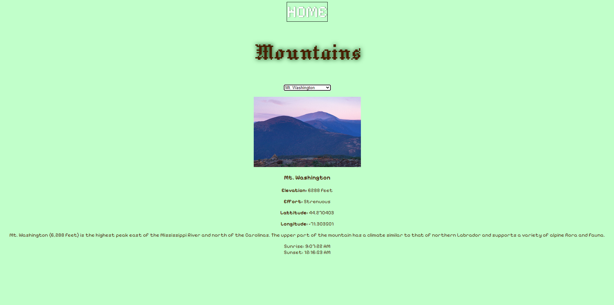

Let's Explaore the Outdoors!
Enjoy the outdoors Capstone 2 Project 5/23/24

Website providing information for an adventurer that want wants to explore the outdoors

My favorite part of this project would be how we got info to show up on the mountains page with javascript

mountainResults.innerHTML = `
             
            
            <h3>${mountain.name}</h3>
            
<b>Elevation:</b> ${mountain.elevation} feet

            
<b>Effort:</b> ${mountain.effort}

            
<b>Lattitude:</b> ${mountain.coords.lat}

            
<b>Longitude:</b> ${mountain.coords.lng}

            
 ${mountain.desc} 

        `;

I find it very interesting that we can input html directly into a javescript file and even edit it with css.